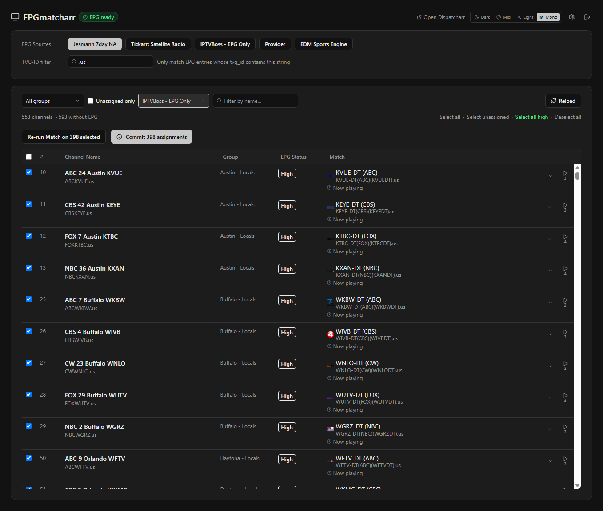

# EPGmatcharr

A standalone Docker container that matches your Dispatcharr channels to EPG sources automatically.

Connect EPGmatcharr to your Dispatcharr instance, run a match, review the results, and commit — channel EPG assignments update instantly without touching Dispatcharr directly.



---

## Features

- **Automatic EPG matching** — fuzzy-matches channel names against XMLTV EPG entries with confidence scoring
- **High / Review confidence badges** — High-confidence matches are auto-selected; Review matches let you pick from ranked candidates
- **Multi-source support** — match against any EPG source configured in Dispatcharr; filter by TVG-ID pattern
- **Bulk workflows** — load all unassigned channels, or filter to channels from a specific existing EPG source to re-match them
- **Now Playing** — shows the current program from the EPG cache for each matched channel
- **Stream preview** — built-in video player for HLS and MPEG-TS streams directly from Dispatcharr
- **EPG cache warming** — downloads and indexes EPG sources in the background with per-source status
- **Inline channel renaming** — edit channel names during the match flow; names commit alongside EPG assignments
- **Themes** — Dark, Mid, Light, and Mono

---

## Quick Start

### 1. Add to your Docker Compose stack

```yaml
services:
  epgmatcharr:
    image: ghcr.io/jstevenscl/epgmatcharr:latest
    container_name: epgmatcharr
    restart: unless-stopped
    ports:
      - "8281:8281"
    volumes:
      - epgmatcharr_data:/app/data

volumes:
  epgmatcharr_data:
```

```bash
docker compose up -d
```

Open **http://your-server:8281** in a browser.

### 2. Configure

On first launch you will see the setup screen. Enter your Dispatcharr URL and API token, then click **Test Connection**. Once confirmed, click **Connect**.

See the [User Guide](docs/USERGUIDE.md) for the full setup walkthrough with screenshots.

---

## Building from Source

```bash
git clone https://github.com/jstevenscl/epgmatcharr.git
cd epgmatcharr
docker build -t epgmatcharr:latest .
```

---

## Environment Variables

All configuration can be done through the web UI. The following environment variables are optional overrides:

| Variable | Description |
|---|---|
| `DISPATCHARR_URL` | Dispatcharr base URL (e.g. `http://192.168.1.100:9191`) |
| `DISPATCHARR_TOKEN` | Dispatcharr API token |

If set, these take priority over anything saved through the UI.

---

## Data Persistence

EPGmatcharr stores all configuration and the EPG cache in the named volume `epgmatcharr_data` (mounted at `/app/data` inside the container). This includes:

- `config.json` — Dispatcharr URL, token, EPG settings, credentials
- `epg_cache.json` — cached EPG data (rebuilt automatically on startup and on TTL expiry)
- `sessions.json` — active login sessions

The EPG cache survives container restarts. To force a full re-download, delete `epg_cache.json` from the volume before restarting.

---

## EPG Cache Settings

Configurable via **Settings → EPG Cache** in the UI:

| Setting | Default | Description |
|---|---|---|
| TTL | 1 hour | How long before the cache is refreshed |
| Window | 7 days | How many days of EPG data to download |

---

## Authentication

EPGmatcharr supports an optional login password. Once credentials are set in Settings, all pages require login. Sessions persist until explicitly logged out.

If no credentials are configured, the app is open to anyone who can reach port 8281 — restrict access via your firewall or reverse proxy if needed.

---

## Requirements

- Docker with Compose
- A running [Dispatcharr](https://github.com/Dispatcharr/Dispatcharr) instance
- Dispatcharr API token (Settings → API in Dispatcharr)
- EPG sources configured in Dispatcharr

---

## User Guide

See **[docs/USERGUIDE.md](docs/USERGUIDE.md)** for a complete walkthrough of both matching workflows with screenshots.
